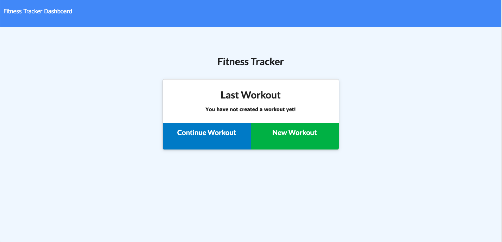
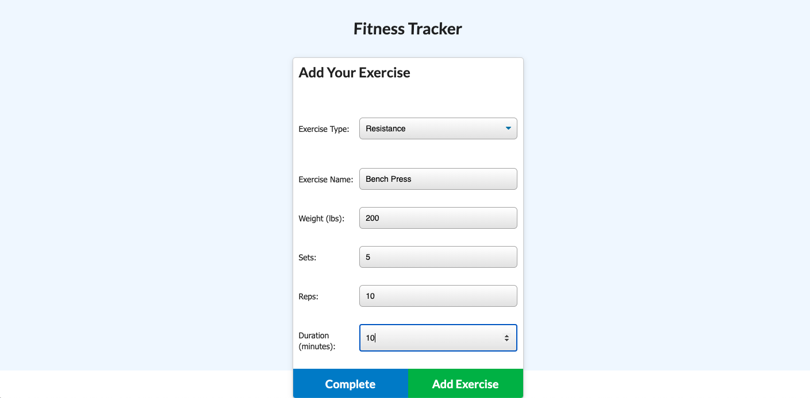
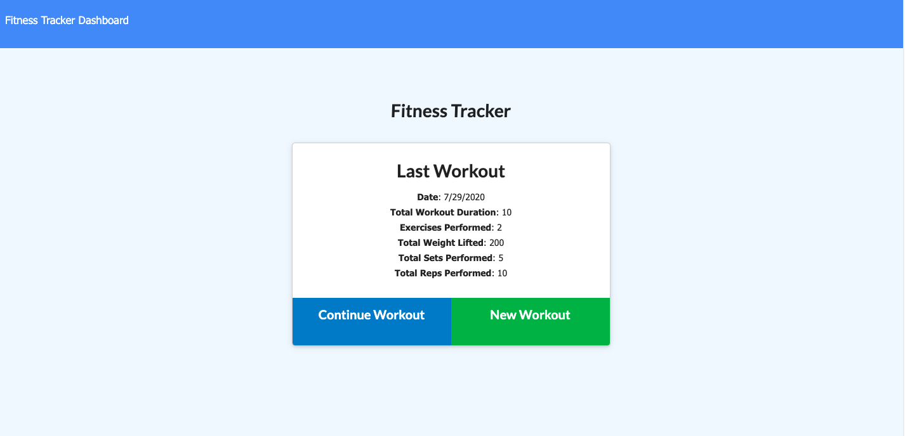
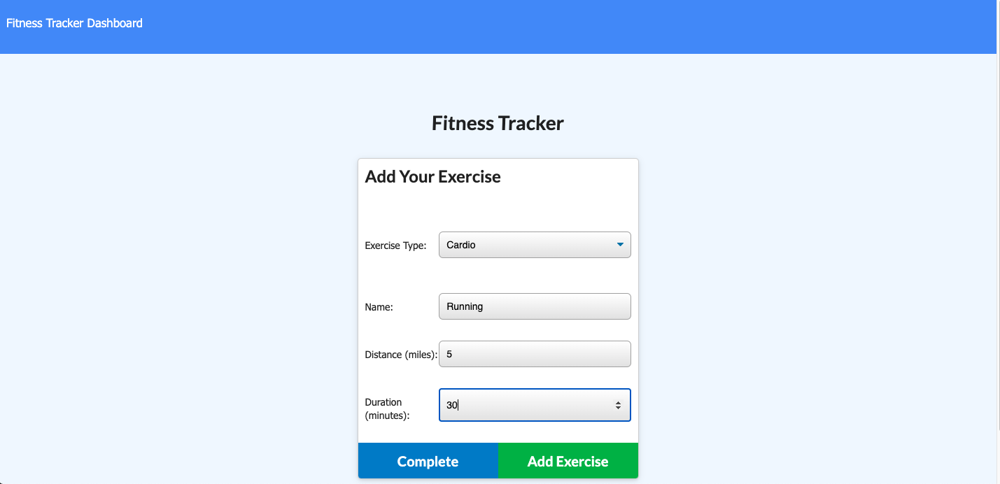
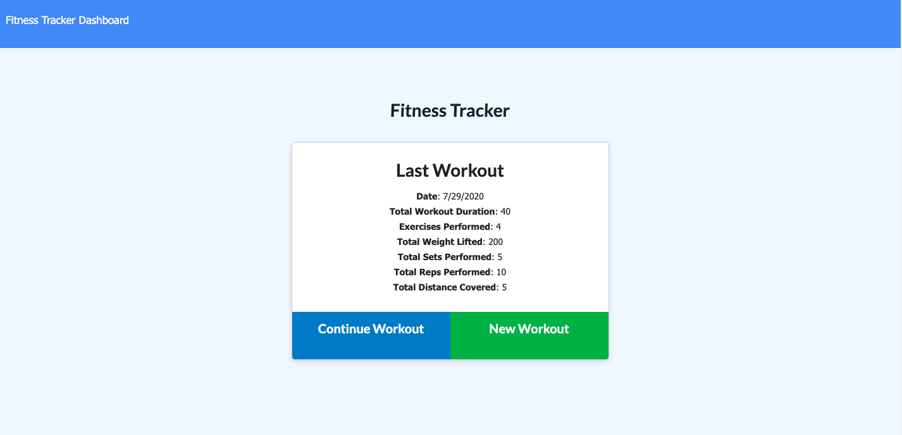
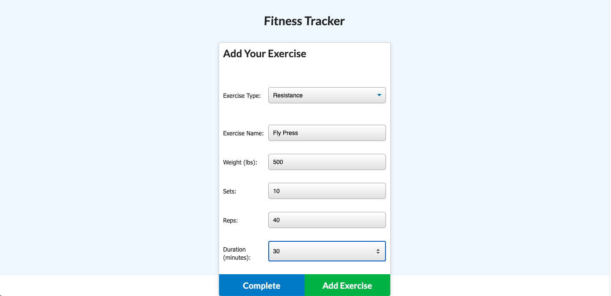
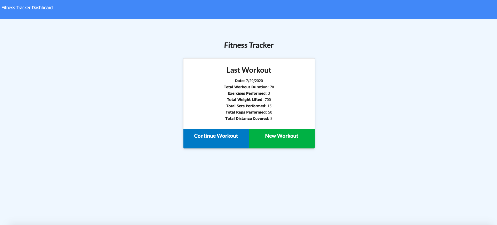
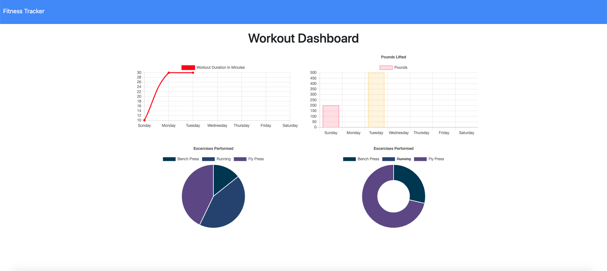

  # Workout Tracker

  

  ## Description

	The days of using a pen and paper to keep track of tasks are dwindling. This application is designed to allow the user to create, view and track workouts on a given day. In return, the Workout Tracker will allow the user to add multiple resistance or cardio exercises for each day, and display the total results after adding each workout. 

	For resistance workouts, the user may effectively track the name, type, weight, sets, reps, and duration of exercise. Regarding the cardio workouts - the distance will be tracked for each exercise.

	This application utilizes MongoDB, mongoose and express to provide functionality. 

  ## Table of Contents

  * [Installation](#installation)

  * [Usage](#usage)

  * [License](#license)

  * [Contributing](#contributing)

  * [Tests](#tests)

  * [Questions](#questions)

  ## Installation
  To install the necessary dependencies, run the following command:
  
  npm i

  ## Usage
  
  [Deployed Link]()

  ## License

  This project is not licensed

  ## Contributing

  [Joshua Homer](https://github.com/Jchomer90)

### Enter as many exercises as you want per workout, and receive cumulative data on each workout. When finished, head to the 'Dashboard' to see day by day workout information.

  ## Questions
  If you have any questions about the repository, open an issue or contact me directly at Joshuachomer@gmail.com.
   You can also find more of my work on [Github](www.github.com/Jchomer90)
  